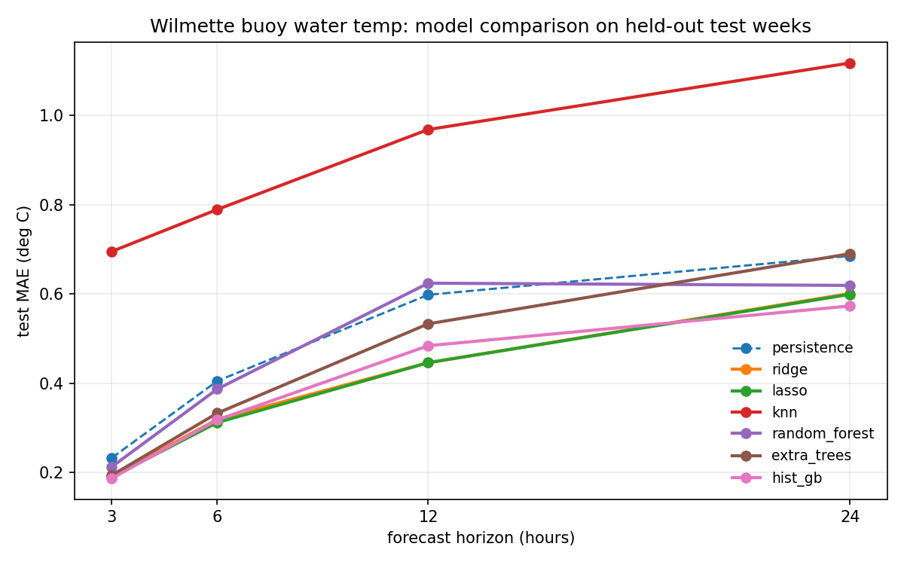

# buoycast

ML forecasts of nearshore water temperature (and, honestly, not wave height) from the Wilmette buoy, NDBC station 45174, a few miles up the shore from the Evanston beaches.

## How it works

1. `python3 fetch.py` downloads the buoy's 2021-2025 historical standard-met archives plus the 45-day realtime feed from NDBC (open data, no key) and writes a merged hourly series to `data/buoy.csv`. The buoy is seasonal (roughly May to November), so winters are gaps.
2. `python3 train.py` builds lag/delta/rolling-wind/seasonal features and trains a `HistGradientBoostingRegressor` per target and horizon (+3, +6, +12, +24 h), holding out the most recent three in-season weeks. Every model is scored against persistence (forecast = current value), the baseline any honest nowcast must beat.
3. `python3 forecast.py` pulls the latest observations, runs the models, prints a readable forecast with holdout error bars, and writes `forecast.json`.

4. `python3 compare.py` is the model bake-off: ridge, lasso, kNN, random forest, extra trees, and gradient boosting, ranked by 3-fold walk-forward CV inside the training years, then scored once on the untouched test weeks. The CV winner per horizon becomes the production model.

## Bake-off results (water temp, test MAE in deg C)

| Model | +3h | +6h | +12h | +24h |
| --- | --- | --- | --- | --- |
| persistence | 0.233 | 0.405 | 0.598 | 0.685 |
| ridge | 0.192 | 0.319 | 0.446 | 0.601 |
| **lasso (chosen)** | 0.190 | 0.312 | 0.446 | 0.599 |
| kNN | 0.695 | 0.789 | 0.968 | 1.117 |
| random forest | 0.213 | 0.387 | 0.624 | 0.619 |
| extra trees | 0.194 | 0.333 | 0.533 | 0.690 |
| hist gradient boosting | 0.187 | 0.318 | 0.484 | 0.573 |

Lasso wins by CV at every horizon and cuts persistence error by 18 to 25%. Regularized linear models beating trees is the expected result for a smooth physical series with informative lags; the rolling wind-vector features carry the upwelling signal (sustained alongshore wind pushes warm surface water offshore and cold water up). Wave height still loses to persistence at every horizon, which is physically expected: waves on this fetch are made by wind that has not happened yet. The forecast output flags those rows; the fix would be Open-Meteo forecast winds as future covariates.

## Notes

- Wilmette buoy is also on the GLOS Seagull platform; NDBC text feeds were chosen for zero-auth simplicity.
- Sensors report every 10 minutes in season; everything here works on hourly means.
- Lifeguard-relevant: the upwelling events this model is good at are the ones that drop swim areas 10F overnight.
